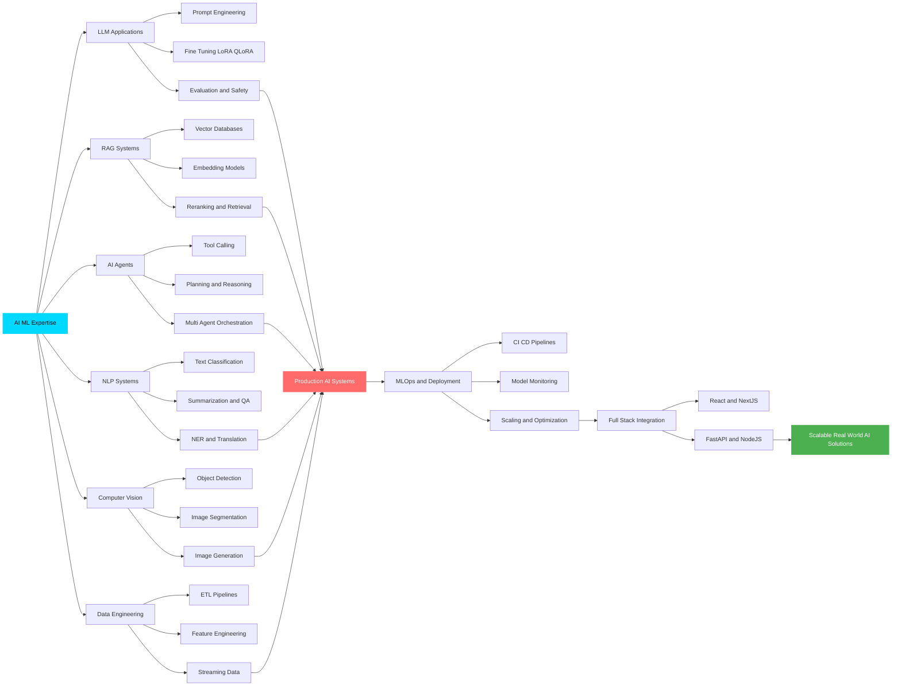

# 🚀 Welcome to My Digital Workshop

## 👨‍💻 Professional Summary

**AI & Machine Learning Engineer** specializing in cutting-edge artificial intelligence solutions. Expert in developing **LLM-powered applications**, **RAG systems**, and **autonomous AI agents** with full-stack development expertise.

### 🎯 Core Expertise

<table>
<tr>
<td align="center" width="25%" style="border: none;">

<h3 style="margin: 15px 0 10px 0;">AI/ML Development</h3>

LLM • RAG • AI Agents

Deep Learning • NLP • CV

TensorFlow, PyTorch, LangChain

</td>
<td align="center" width="25%" style="border: none;">

<h3 style="margin: 15px 0 10px 0;">Frontend Development</h3>

React • Next.js • Vue.js

TypeScript • Tailwind CSS

Modern UI/UX Implementation

</td>
<td align="center" width="25%" style="border: none;">

<h3 style="margin: 15px 0 10px 0;">Backend Development</h3>

Node.js • Django • FastAPI

Laravel • Express • REST APIs

Scalable Server Architecture

</td>
<td align="center" width="25%" style="border: none;">

<h3 style="margin: 15px 0 10px 0;">MLOps & DevOps</h3>

Docker • CI/CD • Cloud

Model Deployment • Monitoring

AWS, GCP, Azure Infrastructure

</td>
</tr>
</table>

 

### 🔥 Currently Working On
- 🤖 Advanced LLM fine-tuning & prompt optimization
- 🔍 Production-grade RAG pipelines
- 🎯 Multi-agent AI systems
- ⚡ MLOps & model deployment

 

---

## 🛠️ Technology Arsenal

### 🤖 AI & Machine Learning Stack

### 💻 Full Stack Development

### 🗄️ Database & DevOps

---

## 🧠 AI Specializations

<table>
<tr>
<td width="33%" valign="top">

### 🎓 Machine Learning & Deep Learning
- ✨ Neural Networks (CNN, RNN, LSTM, GRU)
- ✨ Transformer Architecture & Attention Mechanisms
- ✨ Transfer Learning & Fine-tuning
- ✨ Model Optimization & Quantization
- ✨ Hyperparameter Tuning & AutoML
- ✨ Ensemble Methods & Model Stacking

### 🤖 Large Language Models (LLM)
- ✨ GPT (3.5, 4, 4-Turbo), Claude, Gemini
- ✨ BERT, RoBERTa, T5, LLaMA
- ✨ Prompt Engineering & Chain-of-Thought
- ✨ Few-shot & Zero-shot Learning
- ✨ LLM Fine-tuning (LoRA, QLoRA, PEFT)
- ✨ Token Management & Context Optimization
- ✨ Model Evaluation & Benchmarking

### 🔍 Retrieval-Augmented Generation (RAG)
- ✨ Vector Databases (Pinecone, ChromaDB, FAISS, Weaviate)
- ✨ Embedding Models (OpenAI, Sentence-BERT, Cohere)
- ✨ Semantic Search & Hybrid Search
- ✨ Document Processing & Chunking Strategies
- ✨ Context Window Optimization
- ✨ Query Rewriting & Expansion
- ✨ Re-ranking & Relevance Scoring

</td>
<td width="33%" valign="top">

### 🎯 AI Agents & Automation
- ✨ Autonomous Agent Development
- ✨ Multi-Agent Systems (AutoGen, CrewAI)
- ✨ ReAct Framework & Chain-of-Thought
- ✨ Tool Use & Function Calling
- ✨ Agent Memory & State Management
- ✨ Planning & Reasoning Frameworks
- ✨ Agent Orchestration & Workflows
- ✨ LangChain & LangGraph Integration

### 📝 Natural Language Processing
- ✨ Text Classification & Categorization
- ✨ Sentiment Analysis & Opinion Mining
- ✨ Named Entity Recognition (NER)
- ✨ Text Summarization (Extractive & Abstractive)
- ✨ Machine Translation & Multilingual NLP
- ✨ Question Answering Systems
- ✨ Text Generation & Content Creation
- ✨ Intent Detection & Slot Filling

### 👁️ Computer Vision
- ✨ Image Classification & Recognition
- ✨ Object Detection (YOLO, Faster R-CNN, SSD)
- ✨ Image Segmentation (Semantic & Instance)
- ✨ Face Recognition & Detection
- ✨ Feature Extraction & Representation Learning
- ✨ Image Generation (GANs, Diffusion Models)

</td>
<td width="33%" valign="top">

### 🔬 MLOps & Model Deployment
- ✨ Model Versioning & Experiment Tracking
- ✨ CI/CD for ML Pipelines
- ✨ Model Monitoring & Performance Tracking
- ✨ A/B Testing & Model Evaluation
- ✨ Container Orchestration (Docker, Kubernetes)
- ✨ Cloud Deployment (AWS, GCP, Azure)
- ✨ Model Serving & API Development
- ✨ Scalability & Load Balancing

### 📊 Data Engineering & Processing
- ✨ ETL/ELT Pipeline Development
- ✨ Data Cleaning & Preprocessing
- ✨ Feature Engineering & Selection
- ✨ Data Augmentation Techniques
- ✨ Big Data Processing (Spark, Hadoop)
- ✨ Stream Processing & Real-time Analytics
- ✨ Data Versioning & Lineage Tracking

### 🛡️ AI Security & Ethics
- ✨ Prompt Injection Prevention
- ✨ Model Safety & Alignment
- ✨ Bias Detection & Mitigation
- ✨ Privacy-Preserving ML
- ✨ Responsible AI Development
- ✨ Model Interpretability & Explainability

### 🔧 Specialized Techniques
- ✨ Reinforcement Learning (RL)
- ✨ Time Series Analysis & Forecasting
- ✨ Anomaly Detection
- ✨ Recommendation Systems
- ✨ Graph Neural Networks (GNN)

</td>
</tr>
</table>

---

## 📊 GitHub Analytics

### 📈 Contribution Activity

---

## 🌐 Professional Network

---

## 💡 Development Philosophy

### *"Building intelligent systems that bridge the gap between AI capabilities and real-world applications"*

